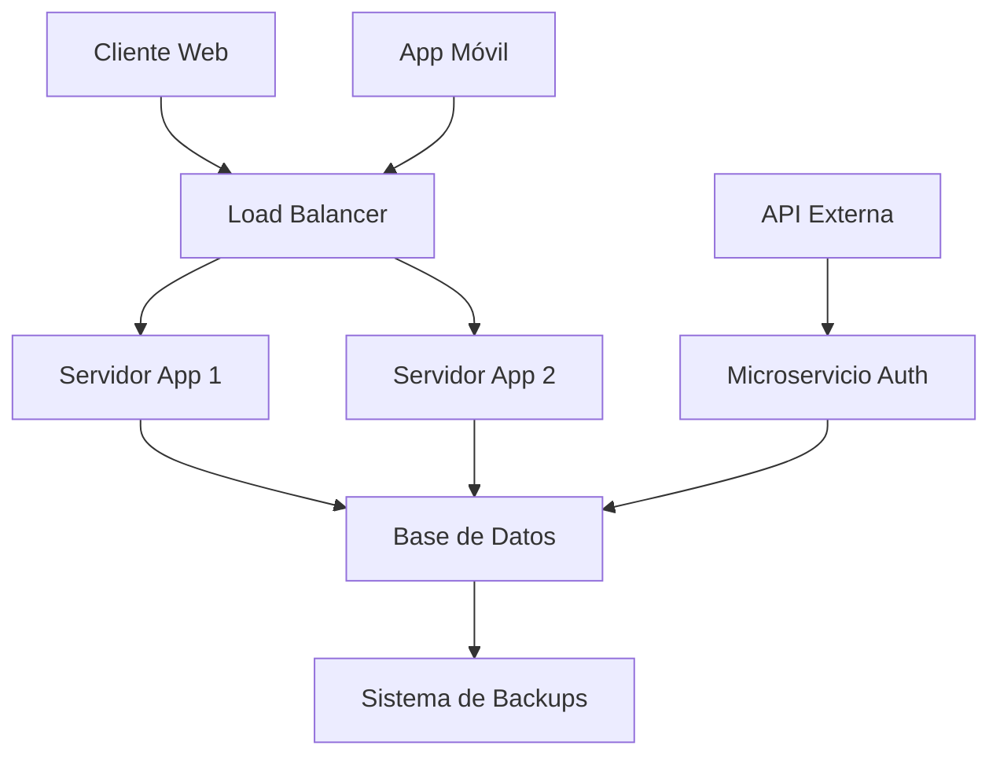

## Mermaid

```mermaid
graph TD
    A[Cliente Web] --> B[Load Balancer]
    B --> C[Servidor App 1]
    B --> D[Servidor App 2]
    C --> E[Base de Datos]
    D --> E
    E --> F[Sistema de Backups]
    G[App Móvil] --> B
    H[API Externa] --> I[Microservicio Auth]
    I --> E
```

## Ecuacion crecimiento usuarios
```mermaid
    U(t) = U_0 * e^(rt)
```
## Ecuacion ROI
```mermaid
    ROI = \frac{Beneficio - Inversión}{Inversión} \times 100
```
